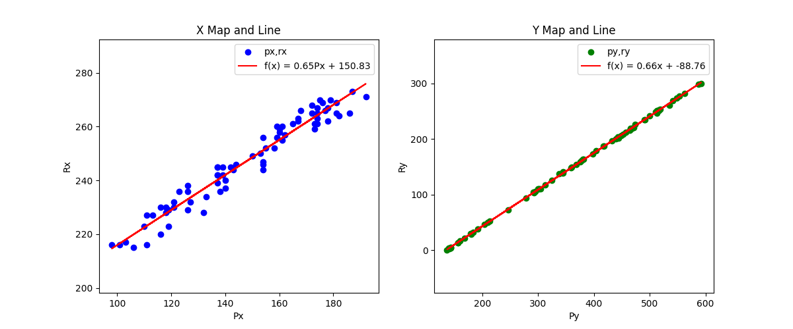

# BlockPicking


This Project is an implementation for control algorithms for UFactory Lite 6 robot.
Picking up a block requires,

1. Identifying a block using YOLO model
2. Finding the center of the box (Px,Py)
3. Converting Pixel Coordinates to Robot Coordinates (Rx,Ry)
4. Instructing UArm to move to the position and pick it up and place it on a fixed position

## Methodology

YOLO model has been trained the model on a public dataset available on Roboflow. Find
it [here](https://universe.roboflow.com/tehran-university-of-iran-ethke/instance-segmentation-of-colorful-cube)

Conversion of Pixel Coordinates to Robot Coordinates is done by using Regression

### Using Linear Regression - PseudoInverse


Note: The scales for X map and Y map are different.

$$
\begin{bmatrix}
R_x \\
R_y
\end{bmatrix} = 
\begin{bmatrix}
m_1 & c_1 \\
m_2 & c_2
\end{bmatrix} 
\begin{bmatrix}
P_x \\
P_y
\end{bmatrix}
$$

$$ R*P^{\dagger} = w $$ 
where $ {\dagger} $ is the PseudoInverse
### Using Multivariate Regression to account for rotation

$$
\begin{bmatrix}
R_{1_x} & R_{2_x} & \cdots & R_{n_x} \\
R_{1_y} & R_{2_y} & \cdots & R_{n_y} \\
1 & 1 & \cdots & 1
\end{bmatrix} =
\begin{bmatrix}
m_{1_x} & m_{1_y} & c_1 \\
m_{2_x} & m_{2_y} & c_2 \\
0 & 0 & 1
\end{bmatrix}
\begin{bmatrix}
P_{1_x} & P_{2_x} & \cdots & P_{n_x} \\
P_{1_y} & P_{2_y} & \cdots & P_{n_y} \\
1 & 1 & \cdots & 1
\end{bmatrix}
$$
$$ R*P^{\dagger} = w $$ 
## Installation

```pip install -r requirements.txt```

## Usage

1. Run test_movement.ipynb to test if the robot is connected and can move.
2. Run coord_calibration.ipynb to calibrate the camera and robot coordinate system.
3. Run live_detection.ipynb to start the picking up process.
